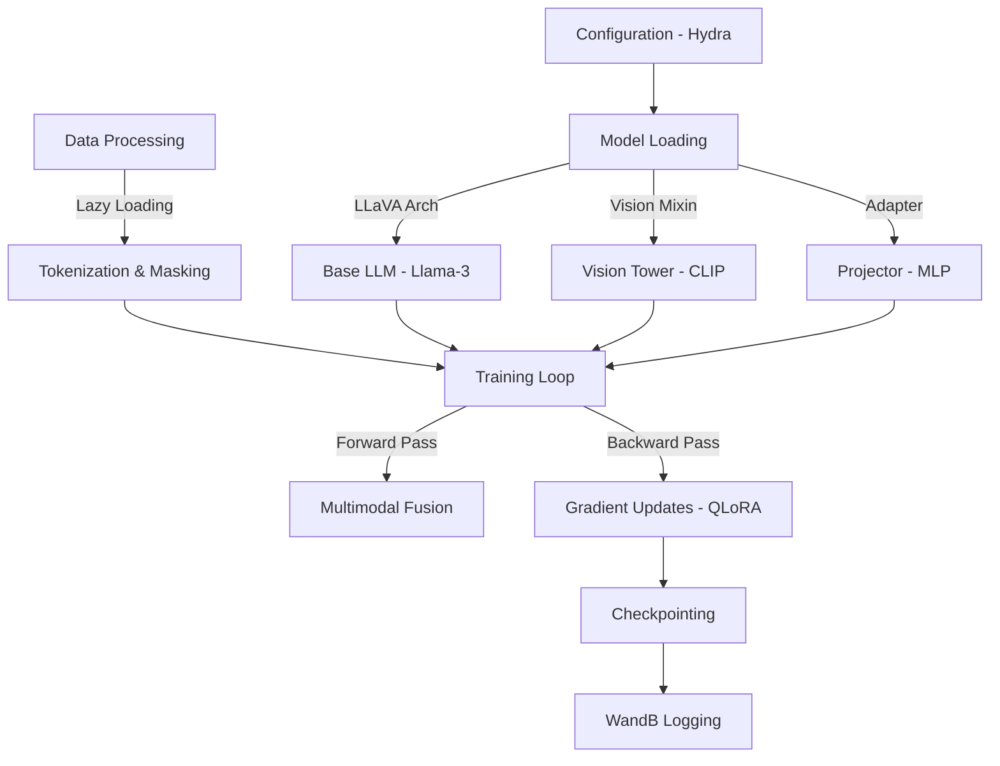

# 🌋 Vision Instruct Recipes

[](https://opensource.org/licenses/Apache-2.0)
[](https://www.python.org/downloads/release/python-3100/)
[](https://hydra.cc/)
[](https://github.com/astral-sh/ruff)

A production-ready pipeline for training **LLaVA (Large Language and Vision Assistant)** models, designed to seamlessly scale from **local consumer GPUs** to **cloud clusters**.

## 📰 News

- **[2026-01-21]** 📘 **Documentation Expansion**: Added comprehensive troubleshooting guides, API references, and developer contribution guidelines.
- **[2026-01-20]** 🚀 **v0.2.0 Release**: 
    - **Refined Output Structure**: Training outputs are now organized by experiment, model, and hyperparameters (e.g., `outputs/cloud_gpu_scale/openai_clip...`) for easier tracking.
    - **Enhanced Cloud Script**: `scripts/train_cloud.sh` now supports optional arguments for experiment names and custom GPU counts (e.g., `bash scripts/train_cloud.sh cloud_gpu_scale 4`).
    - **Documentation Update**: Comprehensive guides for CPU/GPU training and getting started have been consolidated and improved.
- **[2026-01-19]** 🔥 Initial release of Vision Instruct Recipes!

## ✨ Features

- **🚀 Scalable Training**: Seamlessly switch between local debugging (single GPU) and cloud-scale training (multi-GPU with DeepSpeed ZeRO-2).
- **💡 Efficient Fine-Tuning**: Built-in support for **4-bit QLoRA** and **Gradient Checkpointing**, enabling training on consumer cards (e.g., RTX 3090/4090).
- **🛠️ Modular Design**: Clean separation of model architecture, data loading, and training logic using Hydra configuration.
- **📊 Experiment Tracking**: Integrated with **WandB** for real-time loss tracking and visual generation callbacks.

## 🏗️ Pipeline Overview



## 📚 Documentation

For detailed guides, please refer to the `docs/` directory:

- **[Getting Started](docs/getting_started.md)**: Comprehensive guide for setting up and running the pipeline.
- **[Technical Architecture](docs/technical_architecture.md)**: Deep dive into the model, data, and training logic.
- **[Training on GPU](docs/train_gpu.md)**: Best practices for cloud-scale and local GPU training.
- **[Training on CPU](docs/train_cpu.md)**: Guide for debugging and testing on CPU.
- **[Inference & Demo](docs/inference.md)**: How to run the Gradio demo and inference scripts.
- **[API Reference](docs/api_reference.md)**: High-level overview of modules and classes.
- **[Troubleshooting](docs/troubleshooting.md)**: Solutions for common errors.

## 🛠️ Installation

> 💡 For a comprehensive setup guide, see **[Getting Started](docs/getting_started.md)**.

1. **Clone the repository**
   ```bash
   git clone https://github.com/christianlee-pku/vision_instruct_recipes.git
   cd vision_instruct_recipes
   ```

2. **Create a Conda environment**
   ```bash
   conda create -n llava python=3.10
   conda activate llava
   ```

3. **Install dependencies**
   
   - **For Cloud/GPU Users (Recommended)**:
     Optimized for CUDA-enabled GPUs and QLoRA stability.
     **Note**: Ensure your installed CUDA version matches the requirements of the packages (e.g., PyTorch 2.1+).
     ```bash
     # Install GPU-optimized stack
     pip install -r requirements_gpu.txt
     ```

   - **For Local/CPU Users (Debugging)**:
     Lightweight setup for code verification on laptops.
     ```bash
     pip install -r requirements_cpu.txt
     ```

## 🚀 Usage

### 1. Data Preparation
1. Download the COCO 2017 dataset images to `data/coco/images`.
2. Place your instruction tuning JSON file (e.g., `llava_instruct_150k.json`) in `data/coco/`.
3. Update `configs/data/default.yaml` if your paths differ.

### 2. Local Debugging (Lite Mode)
> 📘 See **[CPU Training Guide](docs/train_cpu.md)** or **[GPU Training Guide](docs/train_gpu.md)** for detailed instructions.

Run a quick training loop on a single GPU (or CPU) to verify the pipeline. This profile uses QLoRA and aggressive memory optimization.

```bash
# Run using the provided script
bash scripts/train_local.sh

# Or directly with python
python scripts/train.py experiment=local_lite
```

### 3. Cloud Scale Training
> 🚀 See **[GPU Training Guide](docs/train_gpu.md)** for multi-node/DeepSpeed configurations.

Run full-scale distributed training using DeepSpeed ZeRO-2.

```bash
# Run using the provided script
bash scripts/train_cloud.sh

# Or using accelerate directly
accelerate launch scripts/train.py experiment=cloud_scale
```

### 4. Interactive Demo
> 🤖 See **[Inference & Demo Guide](docs/inference.md)** for details on using the Gradio UI.

Launch a Gradio web interface to chat with your trained model.

```bash
python scripts/demo.py \
    --base_model HuggingFaceTB/SmolLM-135M \
    --adapter ./checkpoints/local_lite/checkpoint-final
```

## 📂 Project Structure

```text
vision_instruct_recipes/
├── checkpoints/         # Model artifacts and training checkpoints
├── configs/             # Hydra configuration files
│   ├── data/            # Dataset configurations
│   ├── deepspeed/       # DeepSpeed optimization configs
│   ├── experiment/      # Experiment profiles (local_lite, cloud_scale, etc.)
│   ├── hydra/           # Hydra core settings
│   ├── model/           # Model architecture configs
│   └── training/        # Training hyperparameters
├── data/                # Dataset storage (e.g., COCO images, JSONs)
├── docs/                # Project documentation and guides
├── outputs/             # Hydra output directories (logs per run)
├── scripts/             # Execution and utility scripts
│   ├── demo.py          # Interactive Gradio demo
│   └── train.py         # Main training entry point
├── specs/               # Feature specifications and planning documents
├── src/                 # Source code
│   ├── data/            # Data loading, entities, and collators
│   ├── models/          # LLaVA architecture, encoder, and projector
│   ├── training/        # Trainer loop and callbacks
│   └── utils/           # Logging and configuration helpers
├── tests/               # Unit and integration tests
└── wandb/               # Weights & Biases experiment logs
```

## 📜 License

This project is licensed under the Apache 2.0 License.

## 🖊️ Citation

If you use this codebase in your research, please cite:

```bibtex
@misc{vision_instruct_recipes,
  author = {Christian Lee},
  title = {Vision Instruct Recipes: Scalable LLaVA Training Pipeline},
  year = {2026},
  journal = {GitHub repository},
  howpublished = {\url{https://github.com/christianlee-pku/vision_instruct_recipes}}
}
```
